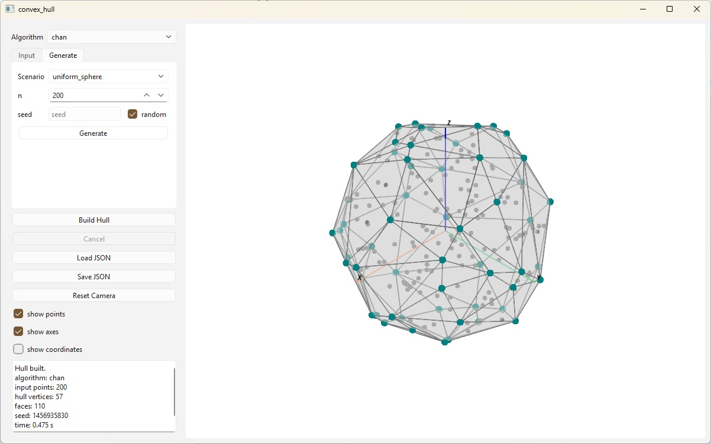

# convex_hull

A desktop application for visualizing and benchmarking Chan's algorithm for
3D convex hull construction. The algorithm itself is developed in a separate
repository, [koltjes/convex_hull](https://github.com/koltjes/convex_hull); this
project provides the GUI built on top of it, point cloud generators, PyVista-based
rendering, and a benchmark harness that uses SciPy/QHull as a reference oracle.



## Running the application

Requires Python 3.13+ and [Poetry](https://python-poetry.org/).

```bash
poetry install
poetry run convex_hull
```

The interface lets you generate a point cloud from a chosen scenario (or enter
points manually on the Input tab), build the hull, and save or load results as JSON. 
Two algorithm implementations are exposed: `chan` and `bruteforce_degenerate`. 

## Benchmarking

The benchmark script runs `chan` against SciPy across a matrix of scenarios and
input sizes, writes raw timings to `raw.jsonl`, aggregates to `summary.jsonl`,
and produces plots:

```bash
poetry run python scripts/bench_snapshot_chan_scipy.py --help
```

## Standalone build

PyInstaller is kept in a separate optional group so it isn't installed in the
default runtime:

```bash
poetry install --with build
poetry run python scripts/build_pyinstaller.py
```

The output is a `build/convex_hull/` directory and a zip archive next to it,
ready for distribution.

## Development

```bash
poetry install --with dev
poetry run pytest
poetry run ruff check src scripts tests
poetry run mypy src
```

## Layout

```
src/
  domain/          Point3D, Vector3D, HullResult3D and other core entities
  geometry/        exact predicates, plane keys
  algorithms/      algorithm wrappers and supporting geometry
  adapters/        adapters bringing algorithms to a common interface
  generators/      point cloud scenarios
  app/             service layer, worker process, state management
  gui/             window, controller, scene widget (PySide6)
  rendering/       PyVista rendering
  verification/    result canonicalization and SciPy oracle
scripts/           benchmark and PyInstaller build
convex_hull/       algorithms provided by https://github.com/koltjes
```